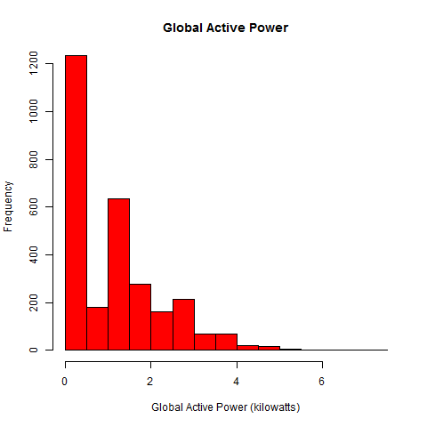

## Exploratory Data Analysis: Course Project


The code for this project was developed and tested on Windows.
However there is code to check OS type and do the necessary modification
to the file download command from http source. In particular,
assumption was made that "curl" would be available and used on Mac/Unix.

Here is the R command to check for the OS type:
```{r}
   if ( .Platform$OS.type  %in% "windows" ) {
      # Using default download method for Win OS
      if(!file.exists(downloadFile)){
              download.file(fileURL,downloadFile)
      }
    } else { 
      # Using curl for download for Mac/Unix OS
      if(!file.exists(downloadFile)){
              download.file(fileURL,downloadFile,"curl")
      }
  }
```

###Files included:
* R code to download and pre-process the data file: <b>data-in.R<b>
* R code to do the plots: 
  * <b>plot1.R</b>
  * <b>plot2.R</b>
  * <b>plot3.R</b>
  * <b>plot4.R</b>


###Steps to run the script:

* Download the script(s) from GITHUB

* Run the scripts:
  * <b>source("plot1.R")</b>
  * <b>source("plot2.R")</b>
  * <b>source("plot3.R")</b>
  * <b>source("plot4.R")</b>

<b>NOTE:</b> Each of the 4 plot scripts above rexecutes the <b>data-in.R</b> script. To avoid re-downloading and re-extracting the data for every plot script executed, the <b>data-in.R</b> script for presence of the download file or unzipped data file.


### Considerations while loading the data


R code snippet to calculate rough estimate of amount of memory 
the dataset will occupy: 


```{r}
 # reading data in small chunks and counting the 
 # number of lines in the file without having to
 # read the entire data in memory
 con <- file("exdata_data_household_power_consumption/household_power_consumption.txt",open="r")
 readsizeof <- 2000
 no_of_lines  <- 0

 while((lines_read <- length(readLines(con,readsizeof))) > 0 ) 
         no_of_lines  <- no_of_lines + lines_read

 close(con)
 no_of_lines


 # read a fixed number of lines and use object_size() function
 # to determine the amount of memory used. This size obtained
 # along with previously obtained total number of lines in the file
 # we can easily determine the total memory requirements
 # NOTE: In my execution, reading in 100 lines used up 15.1 kB
 few_lines <- read.csv("exdata_data_household_power_consumption/household_power_consumption.txt", nrows=10, sep=';')
 few_lines

 size_of_few_lines <- object_size(few_lines)
 size_of_few_lines

```

## The Four Plots

Below are the four plots that created as part of the project:


### Plot 1


 


### Plot 2

 


### Plot 3

 


### Plot 4

 

